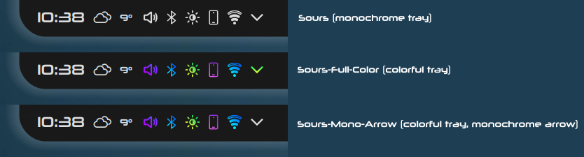

# Sours
Sours is an SVG icon theme for Linux. It is a descendant of [Beautyline](https://store.kde.org/p/1425426) and [Candy](https://github.com/EliverLara/candy-icons) icons, with [Sweet](https://github.com/EliverLara/Sweet-folders)-inspired folders and substantial original artwork added to complete the theme.

Features:

- Tasty gradients
- Symbolic (monochrome) system tray, up to 38px panel size or 'small' in tray settings
- Color-coordinated (files match their app and directory)
- Sci-fi inspired gaps
- Rounded lines
- Uplit

## Installation
- Extract Sours.tar.gz to ~/.local/share/icons

or

- In System Settings -> Appearance -> Icons, use the 'Install from File...' dialog to find and select Sours.tar.gz

then

- In System Settings -> Appearance -> Icons, select Sours and click Apply (lower right)
- It may be necessary to log out and log back in or restart to fully apply the icon theme (icon caches are stubbornly persistent)

### Sours-Full-Color or Sours-Mono-Arrow
To install the same theme with a colorful system tray, perform the above steps for Sours-Full-Color.tar.gz or Sours-Mono-Arrow.tar.gz (the difference between them is the index.theme file)

### For Dolphin to use the provided symbolic icons for named folders (like Downloads or Github) it may be necessary to:
- Right-click the folder and open Properties
- Click the icon next to its name
- Choose the corresponding icon in the dialog

### If an app has a white icon in your app launcher (like KeepassXC):
- Right-click the app in your application launcher
- Select "Edit Application"
- On the General tab, click the app's icon and use the icon browser dialog to choose the properly colored icon

### If an app has white arrows when they should be green (Kate, Okular, etc.):
- Download and install Sours-Full-Color
- Most Qt apps (Kate, Audacious, System Settings, Okular, etc.) will read configurations from their rc file, located in ~/.config (e.g. for Kate, this file is named ~/.config/katerc)

To change the icon theme to full color for a specific app, add the following to an app's rc file, and ensure that the file ends with an empty line:

    [Icons]
    Theme=Sours-Full-Color

### If the icon in the app's titlebar is incorrect (like a Wayland W or a stock icon):
### or
### If an app uses a different icon after it is launched (like Kvantum Preview or Battle.net):
- You can tell KDE which desktop file to use for a particular app by creating a Window Rule:
    - Open the titlebar context menu and navigate to More Actions -> Configure Special Application Settings... -> Add Property -> Desktop file name -> Force -> put the preferred desktop file name
    - .desktop files are located in either ~/.local/share/applications or /usr/share/applications
    - If something goes wrong, delete the Window Rule in System Settings -> Window Management -> Window Rules (default naming scheme: Application settings for "app")
- Explanation: .desktop files are metadata for their corresponding application. Sometimes the metadata that KDE assigns an app when it is installed is different from the metadata that apps send KDE. Using a Window Rule to force KDE to use a particular .desktop file for a particular app means that KDE will use the icon, name, and description specified in that .desktop file to represent the app
- I use this method to correct the OpenRGB icon (desktop file name OpenRGB), to give Kvantum Preview the Kvantum Manager icon (desktop file name kvantummanager), and to make Battle.net behave (desktop file name net.lutris.battlenet-1 if installed through Lutris). 

## Customization
- To use the icon you want for a particular app:
    - Navigate to ~/.local/share/icons/Sours/apps/scalable
    - Duplicate the app's current icon for a backup
    - Duplicate the desired icon
    - Rename the copy of the desired icon to the correct name for the app and Overwrite in the dialog that appears
    
- To use the icon you want for a particular action:
    - Navigate to ~/.local/share/icons/Sours/actions/scalable
    - Duplicate the action's current icon for a backup
    - Duplicate the desired icon
    - Rename the copy of the desired icon to the correct name for the action and Overwrite in the dialog that appears

- Changing icon colors:
    - Use hex color codes in your preferred text editor
    - Changing icon colors in Inkscape, though convenient, is not recommended without taking precautions, because Inkscape ignores the `fill` attribute and only modifies the `style` attribute. Both Inkscape and the Dolphin .svg preview prefer the `style` attribute, while rendered icons prefer the `fill` attribute. This creates a frustrating situation where icons will appear changed in Inkscape and Dolphin but will actually render unchanged. To solve this problem, delete `fill` attribute lines, as long as a fill is provided by the `style` attribute. After deleting `fill` attributes, editing colors in Inkscape should go smoothly.
    - [ColorHexa](https://www.colorhexa.com/) can help you identify colors and provide conversions between RGB(A) and hex color codes

- Change gradient direction in Inkscape using the gradient tool

- Modify icon shapes in Inkscape. The rounded lines can be touchy. To modify individual pieces of an icon, you can duplicate the paths you want to change, stretch/shrink the duplicates, and then use the 'Union' Path tool to make your pieces a single path again, creating a new path with the same rounded edges but a different length/width

## Notes
The conversion of Beautyline and Candy into Sours is still ongoing. Please open an issue if you notice where this process could be accelerated.

### Contributing
Icon themes are inevitably a work in progress. Please open an issue if you notice any stock or broken icons, or to make an icon request.

### License

This project is licensed under the GNU GPL v3 - see the [LICENSE.md](LICENSE.md) file for details.

### Acknowledgements
As noted in the intro, this theme is based on [Beautyline](https://store.kde.org/p/1425426) icons by [sajjad606](https://store.kde.org/u/sajjad606) and [Candy](https://github.com/EliverLara/candy-icons) icons by [EliverLara](https://github.com/EliverLara), and incorporates EliverLara's [Sweet folders](https://github.com/EliverLara/Sweet-folders) as well.

